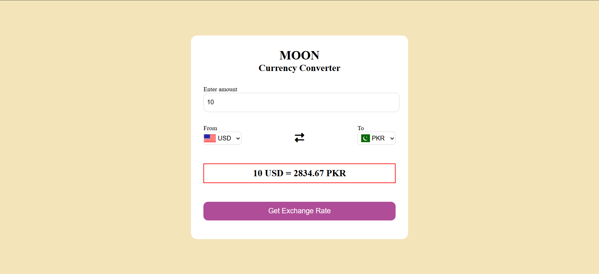

# Moon Currency Converter 🌙

A sleek and user-friendly currency converter web application that provides real-time exchange rates for over 150 currencies worldwide.



## Features ✨

- **Real-time Exchange Rates**: Get the latest currency conversion rates
- **150+ Currencies**: Support for all major world currencies
- **Intuitive Interface**: Clean and modern design with country flags
- **Responsive Design**: Works seamlessly on desktop and mobile devices
- **Quick Conversion**: Instant conversion with a single click
- **Currency Swap**: Easily switch between source and target currencies

## Technologies Used 🛠️

- **HTML5**: For page structure and content
- **CSS3**: For styling and responsive design
- **JavaScript**: For dynamic functionality and API integration
- **Exchange Rate API**: [Fawaz Ahmed's Currency API](https://github.com/fawazahmed0/currency-api)
- **Flags API**: For displaying country flags

## Installation & Setup 🚀

1. Clone or download the project files
2. Open `index.html` in your web browser
3. No additional setup required - it works out of the box!

Alternatively, you can host the files on any web server.

## Usage 📝

1. Enter the amount you want to convert
2. Select the source currency (from)
3. Select the target currency (to)
4. Click "Get Exchange Rate" to see the conversion
5. Use the swap icon (↔) to quickly switch between currencies

## API Reference 🔌

This application uses the [Fawaz Ahmed's Currency API](https://github.com/fawazahmed0/currency-api) which provides:
- Free currency exchange rates
- Frequently updated data (latest rates)
- JSON format responses
- No API key required

## File Structure 📁

```
currency-converter/
│
├── index.html      # Main HTML document
├── style.css       # Stylesheet for the application
├── app.js          # Main JavaScript functionality
├── codes.js        # Currency code to country code mapping
└── ui.png          # Application screenshot
```

## Browser Compatibility 🌐

This application works on all modern browsers including:
- Chrome (recommended)
- Firefox
- Safari
- Edge

## Contributing 🤝

Contributions are welcome! If you'd like to improve this currency converter:

1. Fork the repository
2. Create your feature branch (`git checkout -b feature/AmazingFeature`)
3. Commit your changes (`git commit -m 'Add some AmazingFeature'`)
4. Push to the branch (`git push origin feature/AmazingFeature`)
5. Open a Pull Request

## Future Enhancements 🔮

Potential improvements for future versions:
- Historical exchange rate data
- Currency charts and trends
- Favorite currencies list
- Offline functionality
- Multiple currency conversion
- Currency rate alerts

## License 📄

This project is open source and available under the [MIT License](LICENSE).

## Support 💬

If you have any questions or encounter issues, please open an issue in the repository.

---

**Note**: Exchange rates are provided by a third-party API and may have a slight delay. Always check with your financial institution for the most accurate rates before making transactions.
